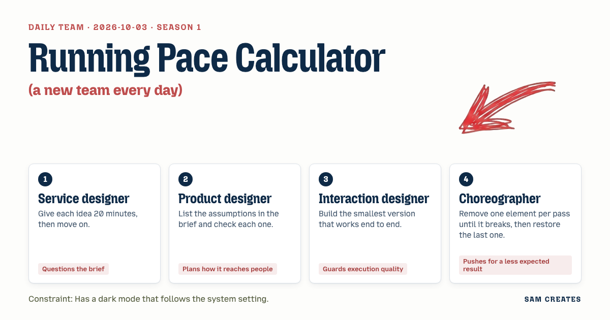

# 2026-10-03: Running pace calculator

[Today](../../README.md) · [Archive](../../ARCHIVE.md)



**Task:** Running pace calculator: distance and time give pace per km and per mile and projected times for 5 km, 10 km, half, and full marathon.

**Constraint:** Has a dark mode that follows the system setting.

**Decision:** The page takes a distance (value + km/mi unit) and a finish time, and returns pace per km, pace per mile, and projected times for 5K, 10K, half marathon, and full marathon, live-updating as you type, with dark mode following system setting.

## Asset

<a href="artifact-1.html"></a>

[artifact-1.html](artifact-1.html), led by Service designer. Model: claude-sonnet-5.

## Team plan

### Proposals

**1. Service designer**
Question: does the user want to enter pace to get time, or time to get pace, or both? 20 minutes on this: the brief says "distance and time give pace," so we build for that one direction only today. One form, two inputs (distance, time), one set of outputs. No reverse calculator, no unit toggle at input — pick km or miles for entry, show both in output.

**2. Product designer**
Assumptions to check: (a) users know their distance in km or miles exactly, (b) users want race projections even for casual runs, (c) dark mode via system setting is expected, not optional. All three hold for a runner checking a training run. Page must work with zero setup — no login, no save — so it reaches someone mid-workout on a phone, one-handed.

**3. Interaction designer**
Smallest end-to-end version: a form with distance (number + unit dropdown: km/mi), hours/min/sec time inputs, one "Calculate" action (or live update on input). Output: pace per km, pace per mile, then a table of 4 rows (5K, 10K, Half, Full) with projected times. Dark mode via `prefers-color-scheme` media query, no JS toggle needed.

**4. Choreographer**
Remove: unit dropdown — broke it, users need both km and mile distance entry sometimes. Restore dropdown. Remove: live-update-on-input — still worked fine, calc button not needed. Keep removed. Push: skip the button, show results as you type, and strip all labels to placeholders for a sparser one-screen feel.

### Objections

- **Product designer → Choreographer (4):** Placeholder-only labels disappear once a user starts typing, so they lose context on what "hours" vs "minutes" means mid-edit. Keep visible labels, drop the button instead.
- **Interaction designer → Service designer (1):** Restricting to one direction (distance+time → pace) is fine for v1, but the brief says "give pace per km and per mile" — need to confirm output includes both without requiring a second input mode, which 1 didn't fully specify.
- **Choreographer → Product designer (2):** Assuming zero setup and one-handed phone use is good, but four race-projection rows plus two pace outputs may be too much vertical content for one unscrolled mobile screen — that assumption needs testing, not just stating.
- **Service designer → Interaction designer (3):** Live-update-on-input with no explicit action risks showing nonsense pace (e.g., division by zero) while a user is still typing partial time values — needs a guard, not just a clean build.

### Decision

The page takes a distance (value + km/mi unit) and a finish time, and returns pace per km, pace per mile, and projected times for 5K, 10K, half marathon, and full marathon, live-updating as you type, with dark mode following system setting.

It answers: Interaction designer's objection to Service designer (confirmed — both km and mile pace always shown, regardless of input unit); Choreographer's objection to Product designer (accepted — results area designed to fit above the fold on mobile, four race rows condensed into a compact table, not cards); Service designer's objection to Interaction designer (accepted — live update only fires once all required fields are non-empty and non-zero, otherwise outputs stay blank/placeholder).

It does not resolve Product designer's objection to Choreographer in full — visible labels are adopted, but whether to keep or drop the calculate button is deferred to the build (interaction designer's call), since removing it was already tested as safe.

### Next steps

1. Interaction designer builds the single HTML/CSS/JS page: form (distance, unit, time), live-calculated output block, pace formulas, and the 4-row projection table.
2. Interaction designer implements `prefers-color-scheme` dark mode styling and adds the zero/empty-input guard before any calculation runs.
3. Product designer reviews the built page on a phone-sized viewport to confirm all outputs fit without scrolling; flags to the team if the table needs to collapse further.

## Team

```text
Team for 2026-10-03

1. Service designer
   Method: Give each idea 20 minutes, then move on.
   Stance: Questions the brief.
2. Product designer
   Method: List the assumptions in the brief and check each one.
   Stance: Plans how it reaches people.
3. Interaction designer
   Method: Build the smallest version that works end to end.
   Stance: Guards execution quality.
4. Choreographer
   Method: Remove one element per pass until it breaks, then restore the last one.
   Stance: Pushes for a less expected result.

Constraint: Has a dark mode that follows the system setting.
Task: Running pace calculator: distance and time give pace per km and per mile and projected times for 5 km, 10 km, half, and full marathon.
```

Provider: claude. Model: claude-sonnet-5.
