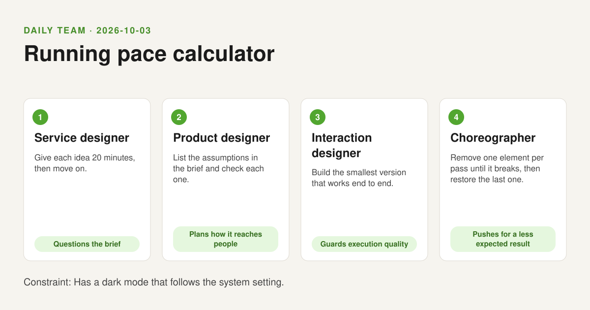
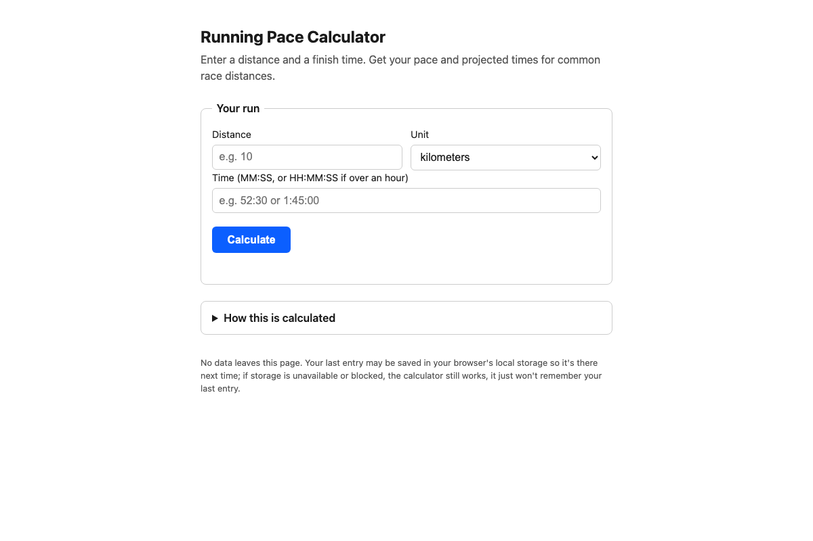

# 2026-10-03: Running pace calculator

[Today](../../README.md) · [Archive](../../ARCHIVE.md)



**Task:** Running pace calculator: distance and time give pace per km and per mile and projected times for 5 km, 10 km, half, and full marathon.

**Constraint:** Has a dark mode that follows the system setting.

**Decision:** The page takes one distance, one unit (km/mile), and one finish time, and returns pace per km, pace per mile, and projected times for 5K, 10K, half marathon, and full marathon, in a single calculation with no accounts or history, styled ...

## Asset

<a href="artifact-1.html"></a>

[artifact-1.html](artifact-1.html), led by Service designer. Model: claude-sonnet-5.

## Team plan

## Proposals

**1. Service designer**
20 minutes on the brief: why just pace? A runner enters distance + time once, and the page answers every question that follows — current pace, equivalent paces, and race projections. Single input, multiple outputs. Reject any version that asks the user to re-enter data for each race distance.

**2. Product designer**
Assumptions to check: (a) users know their distance in km or miles — so give a unit toggle; (b) users think in min:sec, not decimals — so time input is MM:SS or HH:MM:SS; (c) projections assume flat effort, which is wrong for marathon vs 5K, but stating that assumption once is enough, not a reason to cut the feature.

**3. Interaction designer**
Smallest end-to-end version: two fields (distance, time), one calculate action, output table with pace/km, pace/mile, and the four race projections. No charts, no history, no accounts. Dark mode via `prefers-color-scheme`, no toggle. Ship that, then react to feedback.

**4. Choreographer**
Remove: units toggle — breaks it, users need their own unit. Remove: MM:SS parsing, force decimal minutes — breaks it, feels wrong for a running tool. Remove: race projection table, keep only pace — survives, but kills the point of the tool. Restore projections. Final shape: input distance+time+unit, output pace + all four projections, nothing else.

## Objections

**2 objects to 3:** A pure `prefers-color-scheme` approach with zero toggle fails users whose OS setting is hard to change or who want to override temporarily — the constraint says "follows system setting," which this satisfies, but product reach means some users will ask for a manual override later; flag it as a known gap, not silently dropped.

**3 objects to 1:** "Single input, multiple outputs" is fine in principle, but the service designer's framing implies more outputs than the brief asks for (pace/km, pace/mile, four projections — already five numbers plus two paces). Any temptation to add more (splits, VO2 max, etc.) breaks the 20-minute scope and the smallest-end-to-end rule.

**4 objects to 2:** HH:MM:SS parsing for short runs (a 5K) is overkill complexity for the common case; the assumption list didn't test "most inputs are under an hour." Keep MM:SS as default, accept HH:MM:SS only if minutes exceed 59, don't force a three-field input on every entry.

**1 objects to 4:** Removing the unit toggle and calling it "breaks it" skips a step — the choreographer should have tested removing projections *before* restoring them permanently as the anchor; the brief literally names 5K/10K/half/full as required outputs, so that step was predetermined, not discovered. Pass that elimination round to something actually uncertain, like whether both pace/km and pace/mile are needed simultaneously or only the one matching the input unit.

## Decision

The page takes one distance, one unit (km/mile), and one finish time, and returns pace per km, pace per mile, and projected times for 5K, 10K, half marathon, and full marathon, in a single calculation with no accounts or history, styled for light/dark via the system setting.

It answers objection 3→1 by capping outputs at exactly pace/km, pace/mile, and the four named projections — nothing more. It answers 1→4 by treating the pace/km-vs-pace/mile question as still open rather than settled, to be resolved in build. It accepts 4→2: time input defaults to MM:SS, with HH:MM:SS only engaged when minutes exceed 59, avoiding a forced three-field input for short runs. It notes but defers 2→3: no manual dark-mode override in v1, system-setting-only, flagged as a known limitation.

## Next steps

1. Build the single-screen form: distance (number) + unit toggle (km/mile) + time input (MM:SS, auto-expanding to HH:MM:SS past 59 minutes) + one Calculate action.
2. Implement the output block: pace/km, pace/mile, and a four-row table (5K, 10K, half, full) with projected finish times, computed from a flat-pace assumption stated once in a caption.
3. Apply dark mode purely via `prefers-color-scheme` media query in CSS, verify contrast in both modes, no JS-based toggle in this version.

## Team

```text
Team for 2026-10-03

1. Service designer
   Method: Give each idea 20 minutes, then move on.
   Stance: Questions the brief.
2. Product designer
   Method: List the assumptions in the brief and check each one.
   Stance: Plans how it reaches people.
3. Interaction designer
   Method: Build the smallest version that works end to end.
   Stance: Guards execution quality.
4. Choreographer
   Method: Remove one element per pass until it breaks, then restore the last one.
   Stance: Pushes for a less expected result.

Constraint: Has a dark mode that follows the system setting.
Task: Running pace calculator: distance and time give pace per km and per mile and projected times for 5 km, 10 km, half, and full marathon.
```

Provider: claude. Model: claude-sonnet-5.
