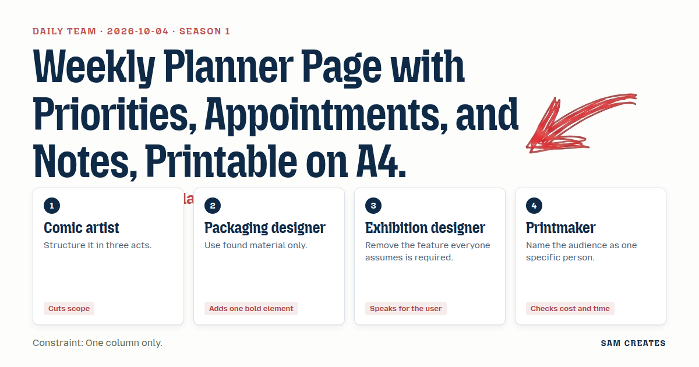
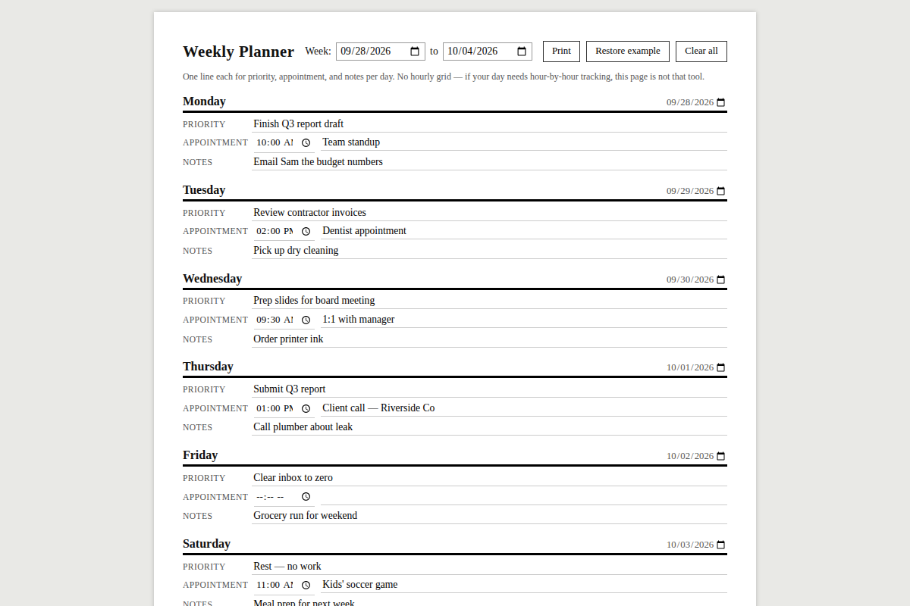

# 2026-10-04: Weekly planner page with priorities, appointments, and notes, printable on A4.

[Today](../../README.md) · [Archive](../../ARCHIVE.md)



**Task:** Weekly planner page with priorities, appointments, and notes, printable on A4.

**Constraint:** One column only.

**Season:** 2026-10-01

**Decision:** The page is a single-column, printable A4 weekly planner with one row per day, each row holding one priority line, one appointment line (with optional time), and one notes line, plus a full-width notes strip at the bottom.

## Asset

<a href="artifact-1.html"></a>

[artifact-1.html](artifact-1.html), led by Comic artist. Model: claude-sonnet-5.

## Team plan

## Proposals

**1. Comic artist**
Act one: top band, single row of seven day labels only, no boxes yet. Act two: middle zone, one tall column split into seven stacked day-sections, each with 3 priority lines and 2 appointment slots. Act three: bottom strip, one open notes lane running full width. Cut the separate "goals" section entirely — seven days of structure is enough load.

**2. Packaging designer**
Build the whole page from one sheet of "found material": a single continuous table element, no divs stacked on divs. One bold element: a thick black rule under each day name, printed solid even in black-and-white, so the page photocopies without losing structure.

**3. Exhibition designer**
Remove the time-gridded hourly schedule everyone expects in a planner — most single-column printables die here from cramped 6am-10pm rows. Speaking for the user: she doesn't track hours, she tracks three things per day — top priority, one appointment, one note — so give her exactly that, repeated seven times, nothing hourly.

**4. Guest — a monk copying a manuscript**
Name the audience as one person: a monk ruling his own page before writing, measuring margins by eye, one column, one pen width, no color, every line load-bearing.

## Objections

- **2 objects to 1:** Three priority lines plus two appointment slots plus notes per day is six zones times seven days — that's 42+ boxes before any notes space exists. On one printable A4 column this will force type under 8pt.
- **3 objects to 2:** A literal HTML `<table>` for found-material purity fights print CSS — table rows don't break cleanly across constrained A4 height, risking an eighth day's worth of content cut off at the page edge.
- **4 objects to 3:** Removing all time anchors entirely strips the one appointment slot of any way to note *when* — a monk still marked canonical hours. At least allow a single optional time field, not a full grid.
- **1 objects to 4:** Manuscript-style margin-by-eye layout is the artist's job, not the guest's — the guest should hand over the method (name one user) and stop dictating page geometry.

## Decision

The page is a single-column, printable A4 weekly planner with one row per day, each row holding one priority line, one appointment line (with optional time), and one notes line, plus a full-width notes strip at the bottom. It accepts objection 2 (cuts priority lines from three to one per day to fit seven days readably) and objection 4 (adds an optional time field to the appointment line). It answers objection 3's structural concern by keeping rows as styled divs, not a table, so print pagination stays controllable. It sets aside objection 1's geometry claim against the guest, since the guest contributed only the "one person" framing, not layout.

## Next steps

1. Build seven day-row components (Mon–Sun), each with priority input, appointment input + optional time field, notes input, divided by a bold black rule.
2. Add a bottom notes strip spanning full page width beneath the seven rows.
3. Write print CSS fixing the layout to one A4 page: fixed row heights, `page-break-inside: avoid` per row, no table markup.

## Team

```text
Team for 2026-10-04
Season: 2026-10-01

1. Comic artist
   Method: Structure it in three acts.
   Stance: Cuts scope.
2. Packaging designer
   Method: Use found material only.
   Stance: Adds one bold element.
3. Exhibition designer
   Method: Remove the feature everyone assumes is required.
   Stance: Speaks for the user.
4. Printmaker
   Method: Name the audience as one specific person.
   Stance: Checks cost and time.

Constraint: One column only.
Task: Weekly planner page with priorities, appointments, and notes, printable on A4.
```

Provider: claude. Model: claude-sonnet-5.
