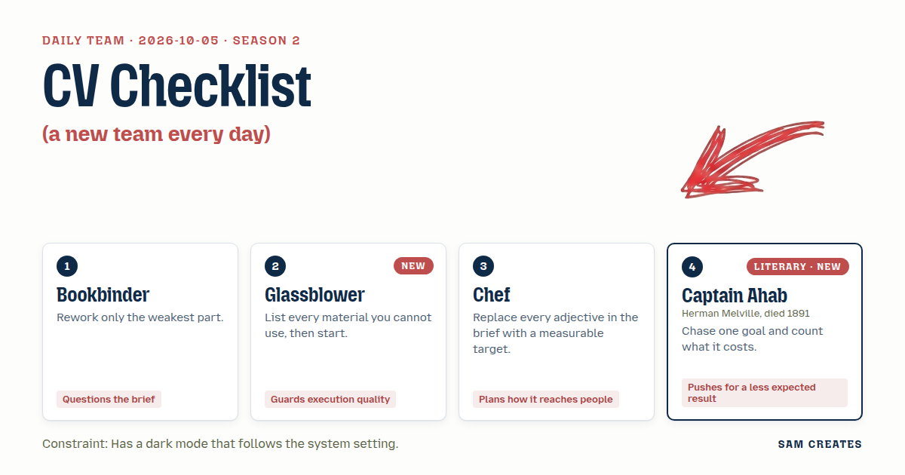
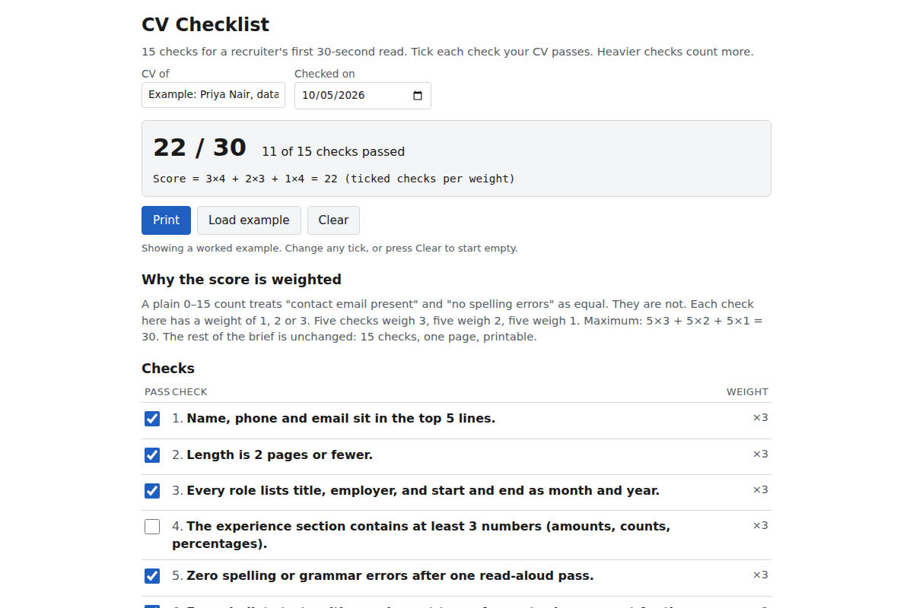

# 2026-10-05: CV checklist

[Today](../../README.md) · [Archive](../../ARCHIVE.md)



**Task:** CV checklist: 15 checks with a score, printable.

**Constraint:** Has a dark mode that follows the system setting.

**Season:** 2026-10-05

**Decision:** The page lists 15 measurable CV checks, scores the ticked ones out of 30 by weight, shows each failed check's effect on a reader, follows the system light or dark setting, and prints on one page.

## Asset

<a href="artifact-1.html"></a>

[Use it](https://isas1.github.io/daily-team/2026-10-05/) · [artifact-1.html](artifact-1.html), led by Bookbinder. Model: claude-opus-5-5.

## Team plan

### Proposals

**1. Bookbinder**
The weakest part of the brief is "a score." A plain 0–15 count treats "no spelling errors" and "contact email present" as equal.
Rework only that part. Each of the 15 checks gets a weight of 1, 2 or 3, for a total of 30.
The user ticks the checks their CV passes. The page shows the score out of 30 and lists the unticked checks, highest weight first.
Everything else stays as the brief states: 15 checks, one page, printable.

**2. Glassblower**
Materials not used: web fonts, CDN links, JS frameworks, images, cookies, a server.
Materials used: one HTML file, under 30 KB, native checkboxes with `<label>`, and about 40 lines of plain JS.
Dark mode uses `@media (prefers-color-scheme: dark)` only. No toggle, so the page cannot drift from the system setting.
`@media print` forces black on white, hides buttons, and prints each checkbox as ☐ or ☑.
Focus outlines show at 3:1 contrast or higher in both modes.

**3. Chef**
Replace each adjective with a target. "Printable" becomes one A4 or Letter page at 10.5pt. "Concise CV" becomes "2 pages or fewer."
"Strong bullets" becomes "every bullet starts with a past-tense verb." "Shows impact" becomes "at least 3 numbers in the experience section."
All 15 checks use this form, so a reader can answer each one in under 10 seconds.
Distribution: one public URL, no login. The printout carries the date and score, so it can go to a mentor or a careers office.

**4. Captain Ahab (guest method: chase one goal and count what it costs)**
One goal: the CV survives a recruiter's first 30-second read.
Each of the 15 checks is kept only if it serves that goal. Checks that do not, such as "has a hobbies section," are cut.
Each unticked check shows its cost as one line: what the reader stops trusting when it fails.
The result is a tally titled "Reasons a reader stops," with a 0–30 score beside it.

### Objections

- **1 to 4:** Labelling each failure with its exact cost claims knowledge the page does not have. Use plain cause-and-effect lines, with no invented figures.
- **2 to 3:** A single page at 10.5pt may overflow on Letter, which is 18 mm shorter than A4. This needs a print test on both sizes before the size is fixed.
- **3 to 1:** A score out of 30 is harder to read at a glance than one out of 15. A mentor seeing "22" on a printout cannot tell what it means without the weights.
- **4 to 2:** Without storage, a reload wipes all 15 ticks. That costs the user the full check. One `localStorage` key with no personal data avoids the loss.

### Decision

The page lists 15 measurable CV checks, scores the ticked ones out of 30 by weight, shows each failed check's effect on a reader, follows the system light or dark setting, and prints on one page.

Answered:
- Objection 1: cost lines describe the reader's reaction, such as "Reader cannot verify the claim." They contain no numbers or seconds.
- Objection 3: the printout shows "22 / 30" with a weight column (1–3) beside each check, so the score can be read without the screen.
- Objection 4: ticks are saved under one `localStorage` key, `cv-checklist-v1`. A "Clear" button removes it.

Accepted:
- Objection 2: the font size stays open until the page passes a print test on both A4 and Letter.

### Next steps

1. Write the 15 checks in Chef's measurable form. Assign each a weight of 1–3 and a one-line reader effect, and remove any check that does not serve the 30-second read.
2. Build the single HTML file. Include the `prefers-color-scheme` and `@media print` blocks, the `localStorage` key, and the weighted score. Keep it under 30 KB with no external requests.
3. Print to PDF on A4 and on Letter in both system modes, 4 prints in total. Confirm one page, black on white, ☐/☑ visible, and the date and score in the header. Then fix the font size.

**Guest:** Captain Ahab (literary; Herman Melville, died 1891). The method is drawn from public-domain history, myth, or literature, or invented. The guest never speaks as the figure, and nothing here is endorsed by anyone.

## Team

```text
Team for 2026-10-05
Season: 2026-10-05

1. Bookbinder
   Method: Rework only the weakest part.
   Stance: Questions the brief.
2. Glassblower [new]
   Method: List every material you cannot use, then start. [new]
   Stance: Guards execution quality.
3. Chef
   Method: Replace every adjective in the brief with a measurable target.
   Stance: Plans how it reaches people.
4. Captain Ahab (literary; Herman Melville, died 1891) [guest] [new]
   Method: Chase one goal and count what it costs.
   Stance: Pushes for a less expected result.

Constraint: Has a dark mode that follows the system setting.
Task: CV checklist: 15 checks with a score, printable.
```

Provider: claude. Model: claude-opus-5-5.
