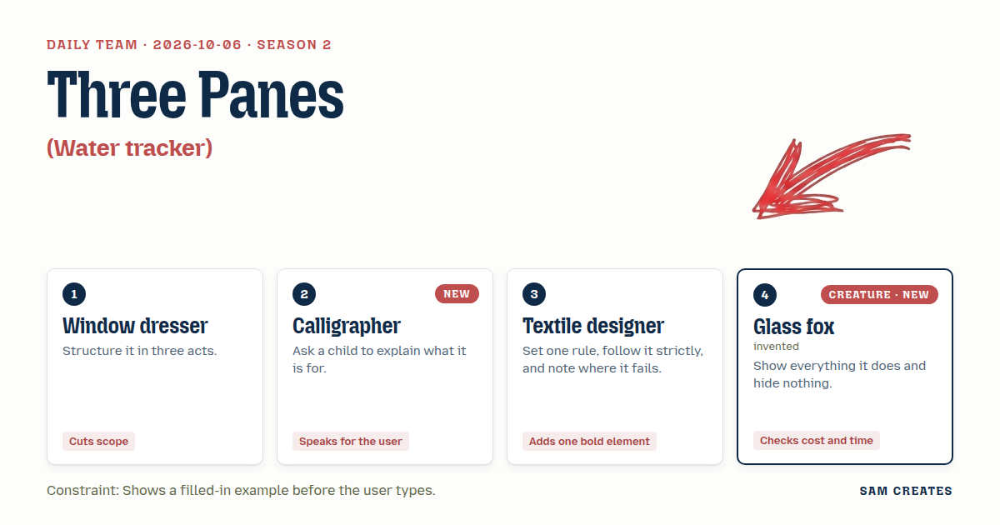
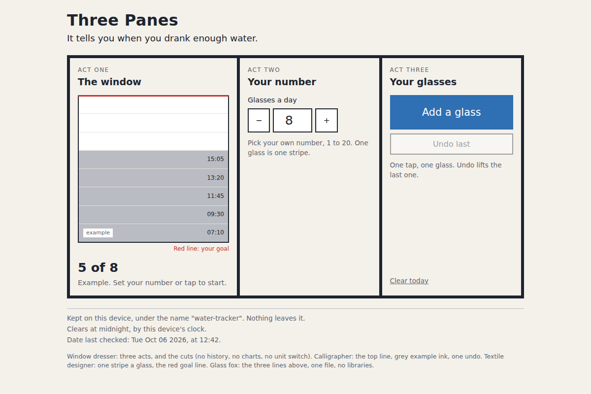

# 2026-10-06: Three Panes

[Today](../../README.md) · [Archive](../../ARCHIVE.md)



**Task:** Water tracker: a daily goal the user sets and a tap-to-add log that resets each day.

**Constraint:** Shows a filled-in example before the user types.

**Season:** 2026-10-05

**Decision:** The page loads with a grey example of 5 stripes under a red goal line at 8, then lets the user set a goal and tap to add one blue stripe per glass, and clears the stripes when the device date changes.

## Asset

<a href="artifact-1.html"></a>

[Use it](https://isas1.github.io/daily-team/2026-10-06/) · [artifact-1.html](artifact-1.html), led by Window dresser. Model: claude-opus-5-5.

## The session

### Pitch

**1 · Window dresser: Three Panes**\
Three panes, one street.\
Act one: the window is dressed before anyone walks up. A goal of 8, five glasses logged, times beside them.\
Act two: you set your number. The dummy steps out.\
Act three: you tap. Each glass lands in the pane where the dummy stood.\
No history. No charts. No unit switch. Three things in the window or it reads as a jumble sale.

**2 · Calligrapher: Ask the Child**\
I asked a seven-year-old. "It tells you when you drank enough water."\
That sentence goes at the top, as written.\
The example sits in pale grey ink. Your own glasses go down in black.\
One tap, one glass. Hands are wet, hands miss, so the last stroke can be lifted with one undo.\
Nothing on the page the child could not read back to me.

**3 · Textile designer: One Stripe a Glass**\
Rule: one glass is one stripe. Same width, same blue, laid bottom to top.\
The goal is a red selvedge running across the cloth at the height of glass 8.\
That red line is the one loud thing. Everything else stays plain.\
Where it fails: glass nine. The rule has nowhere to put it.\
I would rather show that break than hide it.

**4 · Glass fox: Clear Body**\
My body is clear. You see the water I drank and where it sits.\
So the page shows its insides too. Where the count is kept. When it empties. Which date it checked against.\
Three lines at the bottom, always visible.\
Cost: one file, no libraries, under 200 lines.\
The midnight reset is the slow part. Device clock, local date, nothing cleverer.

### Clash

**2 · Calligrapher:** Window dresser, your act one shows a full shelf the user never filled. A child asks whose water that is. Say "example" in the first line, in grey.

**1 · Window dresser:** Calligrapher, the grey I take. The word goes small, on the glass itself. A sign taped across the front of a window reads as closed.

**4 · Glass fox:** Window dresser, your window hides its back room. I want the storage and the reset hour printed on the page, three lines, bottom.

**2 · Calligrapher:** Glass fox, the child stops reading at "localStorage." Write "Kept on this device. Clears at midnight." Same truth, plainer words.

**4 · Glass fox:** Calligrapher, fair, the words change. The date I compared against stays on screen. That part I will not fold away.

**3 · Textile designer:** Window dresser, the log is my stripes. The goal is the red selvedge. That is the one bold mark on the page.

**1 · Window dresser:** Textile designer, stripes and red line both stay. What happens at glass nine on a goal of eight?

**3 · Textile designer:** Window dresser, the ninth stripe spills past the selvedge and over the frame edge. The rule breaks, and the page shows it breaking.

**4 · Glass fox:** Textile designer, a spill means a second layout state and overflow math. Thirty more minutes. Stop the cloth at the frame and print "9 of 8."

**3 · Textile designer:** Glass fox, stopping it hides what happened. Your own rule says show everything.

### Decision

The page loads with a grey example of 5 stripes under a red goal line at 8, then lets the user set a goal and tap to add one blue stripe per glass, and clears the stripes when the device date changes.

Concept: Three Panes

- Window dresser: the three-act order of example, goal, and taps, and the cut list of no history, no charts, and no unit switch.
- Calligrapher: the child's sentence as the top line, grey ink for the example, and one undo for the last tap.
- Textile designer: one stripe per glass and the red selvedge as the only loud color.
- Glass fox: a three-line footer with the storage note, the reset time, and the date last checked, plus the 200-line ceiling.
- Textile designer loses the spill past the frame. The cloth stops at its top edge and the count reads "9 of 8." The count states the overflow in plain text, so nothing is hidden, and the second layout state costs time the page does not need.

### Build notes

1. Write `index.html` with no libraries. Store `{date, goal, taps[]}` under the key `water-tracker` in localStorage. On load and on every tap, compare `new Date().toDateString()` to `date`, and empty `taps` when they differ.
2. Before any input, render the example: goal 8, five grey stripes with times 07:10, 09:30, 11:45, 13:20, 15:05, and a small "example" label on the cloth. Clear the example on the first goal change or the first tap.
3. Draw the cloth as `goal` stripes of equal height with a 3 px red line at the goal. Stop drawing at the frame top. Show the count as "n of goal" under the cloth, with one Undo button beside the Add button.

**Guest:** Glass fox (creature; invented). The method is drawn from public-domain history, myth, or literature, or invented. The guest speaks in character in original words, never quoting the source, and nothing here is endorsed by anyone.

## Team

```text
Team for 2026-10-06
Season: 2026-10-05

1. Window dresser
   Method: Structure it in three acts.
   Stance: Cuts scope.
2. Calligrapher [new]
   Method: Ask a child to explain what it is for. [new]
   Stance: Speaks for the user.
3. Textile designer
   Method: Set one rule, follow it strictly, and note where it fails.
   Stance: Adds one bold element.
4. Glass fox (creature; invented) [guest] [new]
   Method: Show everything it does and hide nothing.
   Stance: Checks cost and time.

Constraint: Shows a filled-in example before the user types.
Task: Water tracker: a daily goal the user sets and a tap-to-add log that resets each day.
```

Provider: claude. Model: claude-opus-5-5.
