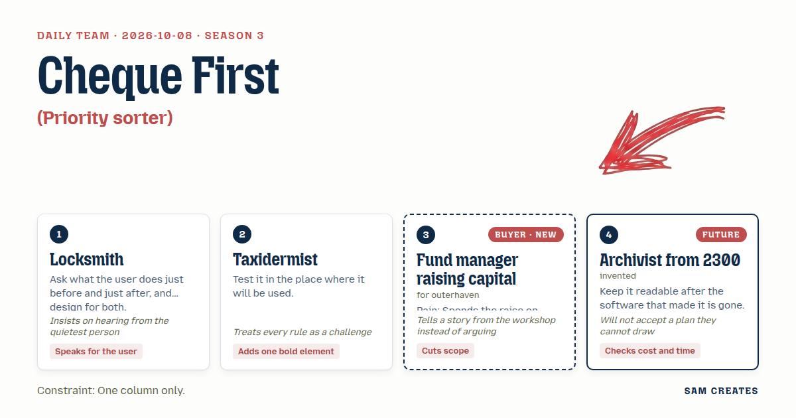
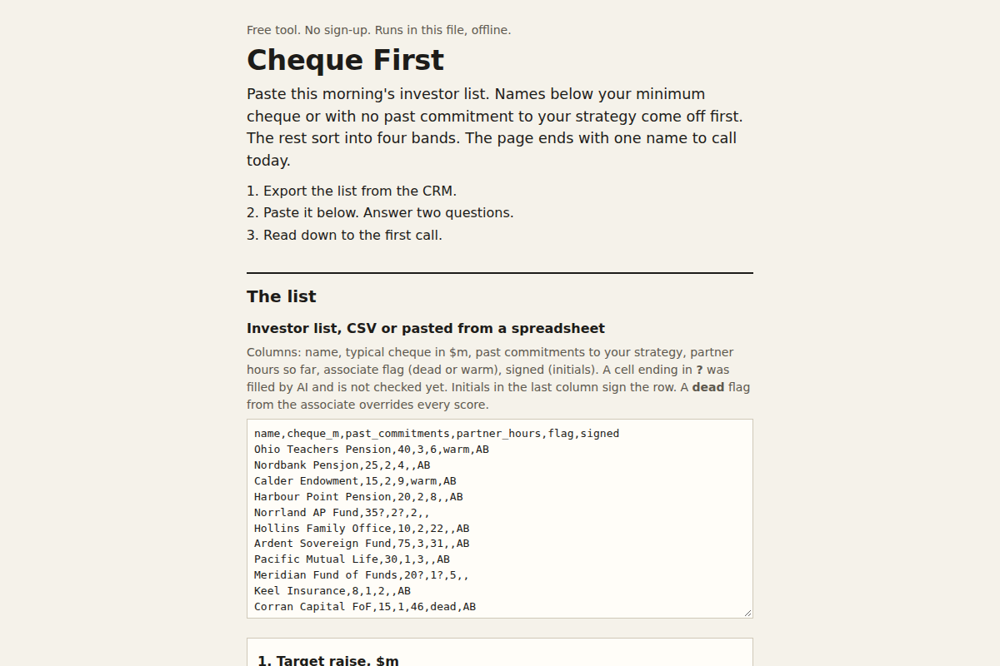

# 2026-10-08: Cheque First

[Today](../../README.md) · [Archive](../../ARCHIVE.md)



**Task:** Priority sorter: a list of problems rated by cost and effort gives a two-by-two grid and the first one to tackle.

**Constraint:** One column only.

**Season:** 2026-10-07

**Decision:** The page takes a pasted investor list, removes anyone below the minimum cheque or without a past commitment to the strategy, sorts the rest into four stacked bands by likelihood to commit and partner hours, and names the first investor t...

## Asset

<a href="artifact-1.html"></a>

[artifact-1.html](artifact-1.html), led by Locksmith. Model: claude-opus-5-5.

## The session

### Pitch

**1 · Locksmith: The Morning List**\
Before this page, an associate exports the investor list from the CRM at seven in the morning.\
After it, a partner picks up the phone.\
So the page takes that pasted list and hands back one name to call today and the names to drop.\
Each row: investor, typical cheque, funds of our strategy backed before, partner hours spent so far.\
Ask the associate first. She keeps the list. She knows which names are dead, and nobody asks her.\
The result ends with the first call, because the call is what happens next.

**2 · Taxidermist: The Mount**\
Test it where it gets used: a partner's phone, between two meetings, one thumb, a taxi.\
One column is the rule. Fine. The grid stacks into four bands, top to bottom. Call first, drop last.\
The bold piece is the drop band. Red. The total partner hours burned on those names, printed huge.\
140 hours. That number goes on the wall like a trophy.\
Nobody reads a scatter plot in a taxi.

**Fund manager raising capital (buyer; outerhaven): Cheque First**\
Last raise, I flew to Zurich twice for a family office.\
Lovely people. Never written a cheque above two million. Our minimum was five.\
I found that out over dinner, nine months in.\
So two filters run before any grid: cheque at or above our minimum, and a past commitment to our strategy.\
Fail both and you don't get a quadrant. You get a line at the bottom.\
Cut the rest. No logos, no onboarding, no "engagement score".

**4 · Archivist from 2300: The Ledger Sheet**\
Most raise trackers I recover are empty shells. The vendor closed and the data went with it.\
This page saves as one HTML file with the list written into it as plain table rows.\
Print it and it reads. Open it in a text editor and it reads.\
Draw the grid as four labelled boxes with the names inside and the hours summed per box.\
Add one cost line: partner hour at 900 dollars, times hours per box.

### Clash

**2 · Taxidermist:** Archivist, a text grid prints well and nobody acts on it. The red band with 140 hours on it is what stops a partner booking the Zurich flight.

**4 · Archivist from 2300:** Taxidermist, draw it for me. Four bands, each a plain section with a heading and a sum. Your red is a border. If the colour is lost, the heading still says "Drop: 140 hours". Then I accept it.

**Fund manager raising capital (buyer; outerhaven):** Locksmith, my associate flagged that Zurich office in month two. I didn't read her note. Asking the quiet one is right, but the page has to put her flag above my opinion, or it's the same meeting again.

**1 · Locksmith:** Fund manager, then her "dead" mark overrides any score. AI fills cheque size and past commitments from Form D filings and pension board minutes, and she checks and signs each row. Research on 40 names drops from about 6 hours to under 1.

**2 · Taxidermist:** Fund manager, here is the shortcut. Same list, two paths. In-house, your partners spend the hours. A placement agent on 2% of what closes costs nothing on the dead names. The agent eats those.

**Fund manager raising capital (buyer; outerhaven):** Taxidermist, I paid an agent 2% on a 180 million close. 3.6 million. Half of it came from my own LPs re-upping. Carve out the existing LPs and I'll look at it. Don't show it as free.

**4 · Archivist from 2300:** Bad case, both paths. Target 200 million, 40 names, 120 partner hours a month at 900 dollars. The raise slips six months and half the call band walks. In-house: 648,000 dollars of extra partner time. Agent with re-ups carved out: the fee falls from 4 million to 2 million, but the agent stops working the middle band after month nine.

**1 · Locksmith:** Archivist, then both paths stack in the result, same inputs, base case and bad case under each. The page asks two things only: target raise size, and months into the raise. The headline is months of partner time already gone.

**2 · Taxidermist:** Locksmith, I still want the drop-band hours at 96 point. A table row stops nobody.

**4 · Archivist from 2300:** Taxidermist, 96 point breaks the printed page and means nothing in a text editor. Keep it a heading.

### Decision

The page takes a pasted investor list, removes anyone below the minimum cheque or without a past commitment to the strategy, sorts the rest into four stacked bands by likelihood to commit and partner hours, and names the first investor to call.

Concept: Cheque First

- Locksmith: the associate's "dead" mark overrides every score, the page asks only raise size and months into the raise, and the result ends with the first name to call.
- Taxidermist: the four bands stack in one column, the drop band carries a red border, and the in-house versus placement agent comparison sits under the grid.
- Fund manager raising capital (buyer; outerhaven): cheque size and track record filter first, failed names go to one line at the bottom, and the agent fee excludes existing LPs.
- Archivist from 2300: the file saves with the data inside as plain table rows, each band has a text heading with summed hours, and every band shows hours times 900 dollars.
- Taxidermist lost the 96 point number. A heading at 32 point prints and still reads as text, and the hours figure gets the same weight in a text editor.
- Bad case: the raise slips six months and half the call band walks. In-house costs 648,000 dollars more in partner time. The agent fee drops to 2 million with the middle band left unworked after month nine. Both paths show the loss, the filters still remove the Zurich-type names on day one, and the page holds.

### Build notes

1. Build the input as one paste box that accepts CSV with five columns: name, typical cheque, past strategy commitments, partner hours to date, associate flag. Add two number fields below it for target raise and months into the raise. No other fields.
2. Run the AI fill on blank cheque and commitment cells from Form D and pension board minutes. Mark each filled cell "AI, unchecked" until the associate signs her initials in the row. Print the hours saved at the foot of the table.
3. Render the result as plain HTML sections in one column: Call, Nurture, Low effort, Drop. Put the bad-case table for in-house and agent paths under the bands. Add a print stylesheet and test it on a phone, on A4 paper, and in a text editor before release.

**Guest:** Archivist from 2300 (future; invented). The method is drawn from public-domain history, myth, or literature, or invented. The guest speaks in character in original words, never quoting the source, and nothing here is endorsed by anyone.

## Team

```text
Team for 2026-10-08
Season: 2026-10-07

1. Locksmith
   Method: Ask what the user does just before and just after, and design for both.
   Stance: Speaks for the user.
   Temperament: Insists on hearing from the quietest person.
2. Taxidermist
   Method: Test it in the place where it will be used.
   Stance: Adds one bold element.
   Temperament: Treats every rule as a challenge.
3. Fund manager raising capital (buyer; outerhaven) [buyer] [new]
   Method: Pain: Spends the raise on investors who will never commit. Walks when: It wastes partner time on people who will not write a cheque. Opens up when: Investors are filtered by cheque size and track record first.
   Stance: Cuts scope.
   Temperament: Tells a story from the workshop instead of arguing.
4. Archivist from 2300 (future; invented) [guest]
   Method: Keep it readable after the software that made it is gone.
   Stance: Checks cost and time.
   Temperament: Will not accept a plan they cannot draw.

Constraint: One column only.
Task: Priority sorter: a list of problems rated by cost and effort gives a two-by-two grid and the first one to tackle.
```

Provider: claude. Model: claude-opus-5-5.
