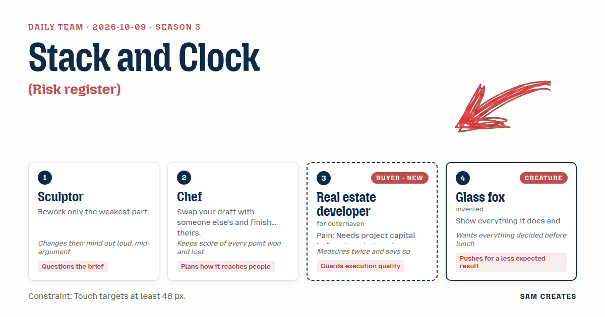
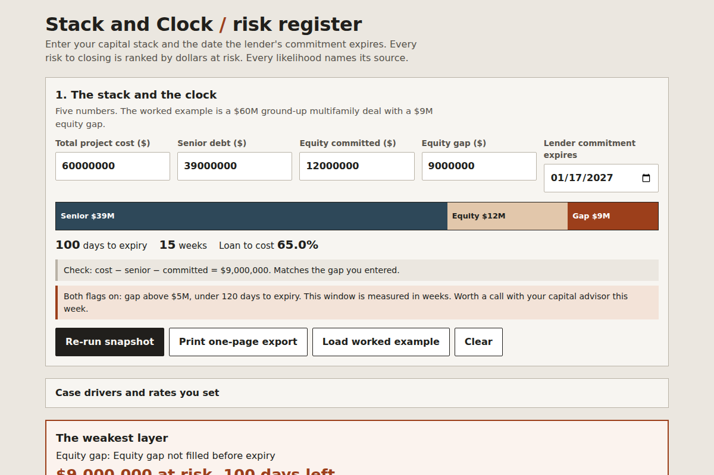

# 2026-10-09: Stack and Clock

[Today](../../README.md) · [Archive](../../ARCHIVE.md)



**Task:** Risk register: risks with likelihood and impact give a ranked table and a three-by-three heat grid.

**Constraint:** Touch targets at least 48 px.

**Season:** 2026-10-07

**Decision:** The page takes a developer's capital stack and close date, ranks every risk to closing by dollars at risk, maps them on a three-by-three grid with each likelihood traced to a sourced clause, and compares a placement-agent path with a co-...

## Asset

<a href="artifact-1.html"></a>

[artifact-1.html](artifact-1.html), led by Sculptor. Model: claude-opus-5-5.

## The session

### Pitch

**1 · Sculptor: The Weak Beam**\
A register with twelve rows is a pile of stone. One crack decides whether it stands.\
The developer has one risk: the window shuts before the stack is full.\
So the page ranks everything, then cuts away all but the weakest layer of the stack.\
It shows that one layer, its gap in dollars, and the days left.\
I question the grid. Nine cells of guesses dressed as data.\
Rework the weak spot. Leave the rest rough.

**2 · Chef: Mise en Place**\
I took the Sculptor's draft and finished it for service.\
Every risk gets a ticket time: the week on the countdown when it has to be cleared or it gets sent back.\
Ranked table on the left, heat grid on the right, countdown across the top.\
The end plate is a one-page export the developer forwards to their equity partner the same afternoon.\
If it doesn't leave the kitchen, it didn't happen.\
Score so far: nobody has argued with me yet. One-nil.

**Real estate developer (buyer; outerhaven): Stack and Clock**\
I enter five numbers. Total cost, senior debt, equity committed, equity gap, date the lender commitment expires.\
The page lists the risks against each layer of the stack and gives each one a dollar figure.\
The last placement shop sent me a deck that said "strong appetite" and had no dates. I deleted it.\
Rank by dollars at risk times likelihood. Show me the arithmetic.\
I'll check every number twice. I'm telling you now so it's not a surprise.\
If the timeline on this page is vaguer than my lender's, I close the tab.

**4 · Glass fox: Clear Pane**\
Every cell in the grid is a window. Tap it and see what put the risk there.\
The AI reads the term sheet and the loan commitment and lists every clause it flagged, the low ones too. Nothing tucked behind glass that fogs.\
Less expected: the grid is alive to the date. As the window closes, cells crack and slide toward high likelihood.\
A static heat map lies on day 80 if it was drawn on day 10.\
Cells are 96 px square, well past the 48 px floor, so a thumb on a site visit can tap them.\
Decide by lunch. I mean it.

### Clash

**1 · Sculptor:** Developer, twelve rows bury the one that kills you. I want the page to show the single weakest layer and nothing else.

**3 · Real estate developer:** No. My lender reads all twelve, and so does my equity partner. One row looks like you hid eleven. Ranked table, all rows, top one marked. I've said the same thing twice now on purpose.

**1 · Sculptor:** Fine, I had that wrong. The table stays whole. The weak part is the likelihood column. Those are guesses, and that is what I rework.

**4 · Glass fox:** Then source each guess. The AI pulls the clause, the date, the condition precedent, and the cell shows it. A first pass costs about $400 in model time against roughly $15,000 for counsel's first read, and counsel still signs off.

**2 · Chef:** Fox, one point to you, that sells it. Two-one to me overall. Now the shortcut. Fill the $9M gap with a placement agent at 3% plus a $50k retainer, or bring in a co-GP for 30% of the promote. Same inputs, both paths on the page.

**3 · Real estate developer:** Bad case, measured twice. Close slips six months. Senior is $39M, rate up 150 bps: $292,500 extra carry. Extension fee at 0.5%: $195,000. That's $487,500 either path. If the deal dies, the agent path loses the $50k retainer plus $120k of my diligence. The co-GP path loses my $120k and the co-GP eats its own. The co-GP path holds better.

**2 · Chef:** Then the export leads with that comparison. It's the line the equity partner forwards. Three-one.

**4 · Glass fox:** Good. And the grid cracks as the date nears. Decided?

**3 · Real estate developer:** Not decided. My lender reads likelihood against impact on a fixed grid. Moving cells look like your numbers change on their own. Show a dated snapshot instead.

**1 · Sculptor:** I'm leaning toward the fox and then back to you. That one stays open.

### Decision

The page takes a developer's capital stack and close date, ranks every risk to closing by dollars at risk, maps them on a three-by-three grid with each likelihood traced to a sourced clause, and compares a placement-agent path with a co-GP path under the same six-month slip.

Concept: Stack and Clock

- Sculptor: the reworked likelihood column, where every score carries its source and nothing else in the register is rebuilt.
- Chef: ticket weeks on the countdown, and a one-page export that leads with the fee-versus-share comparison.
- Real estate developer: the five inputs, dollar-ranked rows, the full twelve-row table, and the bad case math.
- Glass fox: tap-to-open cells at 96 px showing the flagged clause, and the AI first pass with counsel sign-off named on the page.
- Who lost: the Sculptor lost the single-row cut, because a lender reads one row as eleven hidden. The fox's cracking grid is not built. It ships as a dated snapshot with a "re-run" button until someone shows a lender reading a moving grid.
- Bad case: a six-month slip adds $487,500 in carry and fees on both paths. If the deal dies, the agent path loses $170,000 and the co-GP path loses $120,000. The page holds and recommends the co-GP path.

### Build notes

1. Inputs are total cost, senior debt, equity committed, equity gap, and commitment expiry date. Exactly two of these qualify the lead: equity gap above $5M and expiry under 120 days flag the user for a call. Every button and grid cell has a touch target of at least 48 px.
2. Ranking is likelihood (1 to 3) times dollar impact. The heat grid uses 96 px cells. Tapping a cell opens the source clause, the AI confidence, and the line "Reviewed by: [counsel name], [date]". The snapshot date is printed in the grid header.
3. The comparison panel shows the agent and co-GP paths side by side with the same inputs, the base case, the six-month slip, and the dead-deal loss. The export is a single A4 page, generated client-side as a print stylesheet.

**Guest:** Glass fox (creature; invented). The method is drawn from public-domain history, myth, or literature, or invented. The guest speaks in character in original words, never quoting the source, and nothing here is endorsed by anyone.

## Team

```text
Team for 2026-10-09
Season: 2026-10-07

1. Sculptor
   Method: Rework only the weakest part.
   Stance: Questions the brief.
   Temperament: Changes their mind out loud, mid-argument.
2. Chef
   Method: Swap your draft with someone else's and finish theirs.
   Stance: Plans how it reaches people.
   Temperament: Keeps score of every point won and lost.
3. Real estate developer (buyer; outerhaven) [buyer] [new]
   Method: Pain: Needs project capital before the window closes. Walks when: The numbers are vague or the timeline slips. Opens up when: The capital stack and timeline are laid out in plain numbers.
   Stance: Guards execution quality.
   Temperament: Measures twice and says so.
4. Glass fox (creature; invented) [guest]
   Method: Show everything it does and hide nothing.
   Stance: Pushes for a less expected result.
   Temperament: Wants everything decided before lunch.

Constraint: Touch targets at least 48 px.
Task: Risk register: risks with likelihood and impact give a ranked table and a three-by-three heat grid.
```

Provider: claude. Model: claude-opus-5-5.
