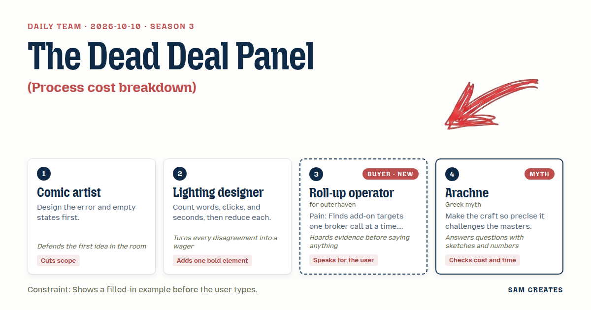
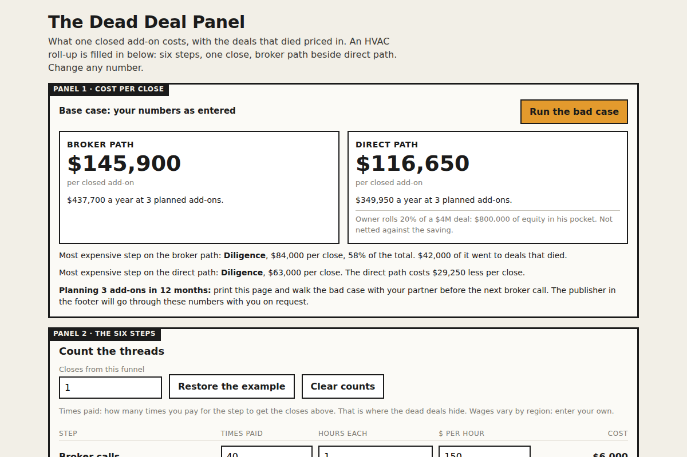

# 2026-10-10: The Dead Deal Panel

[Today](../../README.md) · [Archive](../../ARCHIVE.md)



**Task:** Process cost breakdown: each step of a workflow with time and wage gives the cost per case and the most expensive step.

**Constraint:** Shows a filled-in example before the user types.

**Season:** 2026-10-07

**Decision:** The page shows a roll-up operator what one closed add-on costs across six steps, broker path beside direct path, with the dead deals and the owner's stay-or-leave choice priced in, and turns that into a yearly figure.

## Asset

<a href="artifact-1.html"></a>

[artifact-1.html](artifact-1.html), led by Comic artist. Model: claude-opus-5-5.

## The session

### Pitch

**1 · Comic artist: The Dead Deal Panel**\
I drew the empty page first. It is never empty. It opens with an HVAC roll-up already filled in: six steps, one closed add-on, $145,900.\
Then the error panel. Someone enters zero closes. The page says: "No close yet. Every hour below is still being spent."\
Six rows, no more. Broker calls, CIM read, owner meeting, LOI, diligence, integration.\
Each row has a count, meaning how many times you pay for it per close. Count is where the dead deals hide.\
Two questions sit under the table: add-ons planned in the next 12 months, and months since your last close. The result is a yearly cost.

**2 · Lighting designer: One Bar Lit**\
I counted. 18 fields, 4 clicks, about 90 seconds before a number shows up. Too dark for too long.\
The number has to show at second zero. The example does that.\
Then one bold element: a single horizontal bar per step, all grey, with the most expensive step lit amber.\
Inside the amber bar, the dead-deal share is cut out in a darker band. You see the money you spent on deals that never closed.\
Everything else on the page stays dim.

**Roll-up operator (buyer; outerhaven): Cost Per Close**\
I'll keep this short.\
Forty broker calls for one close. That's my year.\
Every calculator I've been sent stops at the signature.\
Integration is where I bleed. Owners who say they'll stay and don't.\
Show me that and I'll look.

**4 · Arachne: The Warp Before the Weft**\
Count the threads before you weave. 40 calls, 10 CIMs, 4 owner meetings, 2 LOIs, 2 diligences, 1 close.\
Each thread has hours and a price. 120 hours of diligence at $350 is $42,000 a pass. Two passes is $84,000.\
That is 58 percent of the cloth, and half of it goes to a deal that dies.\
A machine reads a CIM and cleans the financials in 1.5 hours where a person takes 6.\
Put that saving next to the old way. The same threads, counted twice.

### Clash

**2 · Lighting designer:** Comic artist, three fields a row times six rows is 18 inputs. I'll bet you he's gone by field seven. Drop the count column and prefill it.

**1 · Comic artist:** Lighting designer, count is the dead deal. Take it out and diligence reads as one $42,000 bill instead of $84,000 for one close. It stays, prefilled. You keep your one lit bar.

**Roll-up operator (buyer; outerhaven):** Comic artist, my last add-on: owner said two years, left at month four. I hired a GM at $140k and lost two techs. If integration is one row with one number, I close the tab. Split it by owner. Stays, leaves.

**4 · Arachne:** Operator, here is the sketch. Owner stays: 500 hours at $65, $32,500. Owner leaves: 800 hours, $52,000, before the GM. The owner meeting row gets one toggle, stay or out, and the integration row follows it.

**1 · Comic artist:** Arachne, I'll take the toggle, since it lives inside a row I already have. I won't take a seventh row for the machine reading. Make it a second column called "Direct path," with the same six steps.

**2 · Lighting designer:** Operator, here's my wager on that column. Direct letters screened by AI, the owner rolls 20 percent and stays 24 months on a vesting clawback. I bet it beats the broker path even when everything goes wrong.

**4 · Arachne:** Lighting designer, the bad case, both paths. Close rate halves and the owner leaves. Broker path: 80 calls, 20 CIMs, 4 diligences, 800 integration hours, $278,800 per close. Direct path: 240 letters at 15 minutes, CIMs at 1.5 hours, 3 diligences because the machine flags one before the accountants start, $220,300. Your wager holds by $58,500.

**Roll-up operator (buyer; outerhaven):** Arachne, your $220,300 leaves out the 20 percent I hand the owner. On a $4M deal that's $800k of equity walking around in his pocket. I forward this to my partner only if that shows.

**2 · Lighting designer:** Operator, I'll bet that a third question for dilution costs you more readers than it earns. Show it as one grey line under the direct column. No input.

### Decision

The page shows a roll-up operator what one closed add-on costs across six steps, broker path beside direct path, with the dead deals and the owner's stay-or-leave choice priced in, and turns that into a yearly figure.

Concept: The Dead Deal Panel

- Comic artist: the prefilled HVAC example, the zero-close error panel, the six-row limit, the count column, and the two questions on planned add-ons and months since the last close.
- Lighting designer: one bar per step, the most expensive step lit amber with the dead-deal band cut out, and the direct-path column.
- Roll-up operator (buyer; outerhaven): the stay-or-out toggle on the owner meeting row, which drives integration hours.
- Arachne: the thread counts, the AI reading time of 1.5 hours against 6, and the bad-case numbers for both columns.
- Lighting designer lost the count column, because without it the dead deals vanish. The dilution question is still open. The operator wants it priced. The lighting designer wants it kept as a fixed grey line. The page ships the grey line, and it gets revisited after the operator shows the page to his partner.

Bad case: the close rate halves and the owner leaves at month four. The broker path costs $278,800 per close and the direct path costs $220,300. Diligence is the most expensive step in both, and the direct path stays cheaper. The page holds and keeps the direct column. The 20 percent rollover is shown as $800k of equity on a $4M deal and is not netted against the saving.

### Build notes

1. Prefill the HVAC example on load. Use these rows: broker calls 40 × 1 h × $150, CIM read 10 × 6 h × $150, owner meeting 4 × 6 h × $150, LOI 2 × 12 h × $450, diligence 2 × 120 h × $350, and integration 1 × 500 h × $65 for an owner who stays or 800 h for an owner who leaves. The broker path should show $145,900. Show the zero-close error panel when the closes field is 0.
2. Render one bar per step in grey. Light the largest step amber. Cut a darker band into it equal to the share spent on deals that did not close. Put the direct-path column beside it with the same inputs. Apply 1.5 h CIM reading and a 25 percent drop in diligence passes, and add a fixed note: "Financial reads reviewed and signed off by your CFO. LOI signed off by deal counsel."
3. Add a "Run the bad case" button. It halves the close rate and sets the owner to "leaves" on both paths. Show $278,800 against $220,300, with the $800k rollover equity as a grey line under the direct column. Multiply each path by the planned add-ons per year. Place one contact line under the result for operators planning 3 or more add-ons.

**Guest:** Arachne (myth; Greek myth). The method is drawn from public-domain history, myth, or literature, or invented. The guest speaks in character in original words, never quoting the source, and nothing here is endorsed by anyone.

## Team

```text
Team for 2026-10-10
Season: 2026-10-07

1. Comic artist
   Method: Design the error and empty states first.
   Stance: Cuts scope.
   Temperament: Defends the first idea in the room.
2. Lighting designer
   Method: Count words, clicks, and seconds, then reduce each.
   Stance: Adds one bold element.
   Temperament: Turns every disagreement into a wager.
3. Roll-up operator (buyer; outerhaven) [buyer] [new]
   Method: Pain: Finds add-on targets one broker call at a time. Walks when: It ignores integration cost and whether owners stay. Opens up when: It shows which owners want to stay on and which want out.
   Stance: Speaks for the user.
   Temperament: Hoards evidence before saying anything.
4. Arachne (myth; Greek myth) [guest]
   Method: Make the craft so precise it challenges the masters.
   Stance: Checks cost and time.
   Temperament: Answers questions with sketches and numbers.

Constraint: Shows a filled-in example before the user types.
Task: Process cost breakdown: each step of a workflow with time and wage gives the cost per case and the most expensive step.
```

Provider: claude. Model: claude-opus-5-5.
